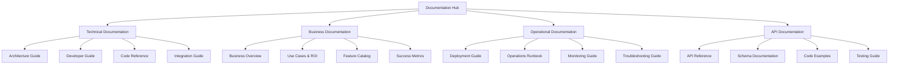

# Design Document

## Overview

This design document outlines the comprehensive documentation solution for the Enhanced Order Prediction Solution. The design focuses on creating a multi-layered, audience-specific documentation ecosystem that serves different user personas while maintaining consistency, discoverability, and maintainability.

The solution will transform the existing basic documentation into a professional-grade documentation suite that includes technical references, business guides, operational runbooks, and interactive examples.

## Architecture

### Documentation Architecture



### Information Architecture

The documentation will be organized in a hierarchical structure that supports both linear reading and random access patterns:

1. **Landing Page**: Executive summary and navigation hub
2. **Quick Start**: Fast-track setup for immediate value
3. **Core Guides**: Comprehensive documentation by audience
4. **Reference Materials**: Detailed technical specifications
5. **Appendices**: Supporting materials and resources

### Content Strategy

#### Audience-Driven Design
- **Primary Personas**: Developers, DevOps Engineers, Business Stakeholders, Data Scientists
- **Secondary Personas**: Security Engineers, Solution Architects, Project Managers
- **Content Mapping**: Each document section mapped to specific persona needs

#### Progressive Disclosure
- **Level 1**: High-level overviews and quick starts
- **Level 2**: Detailed implementation guides
- **Level 3**: Advanced configuration and customization
- **Level 4**: Deep technical reference and troubleshooting

## Components and Interfaces

### Core Documentation Components

#### 1. Executive Documentation Suite
- **Business Overview**: Value proposition, use cases, ROI analysis
- **Solution Architecture**: High-level system design and components
- **Implementation Roadmap**: Phased deployment and adoption strategy
- **Success Metrics**: KPIs, benchmarks, and measurement frameworks

#### 2. Technical Documentation Suite
- **Architecture Deep Dive**: Detailed system architecture with AWS service interactions
- **Data Flow Documentation**: Complete data pipeline with transformation steps
- **API Comprehensive Reference**: Full endpoint documentation with examples
- **Security Architecture**: Security controls, compliance, and best practices

#### 3. Developer Documentation Suite
- **Development Environment Setup**: Local development configuration
- **Code Architecture Guide**: Codebase structure and design patterns
- **Contribution Guidelines**: Development workflow and standards
- **Testing Framework**: Unit, integration, and end-to-end testing

#### 4. Operations Documentation Suite
- **Deployment Playbooks**: Environment-specific deployment procedures
- **Monitoring and Alerting**: CloudWatch setup and alert configuration
- **Incident Response**: Troubleshooting procedures and escalation paths
- **Performance Optimization**: Scaling and cost optimization strategies

#### 5. Data Science Documentation Suite
- **ML Pipeline Architecture**: Model training and inference workflows
- **Feature Engineering Guide**: Data transformation and feature creation
- **Model Performance**: Evaluation metrics and improvement strategies
- **Data Requirements**: Input data specifications and quality standards

### Documentation Interfaces

#### Navigation System
- **Hierarchical Menu**: Multi-level navigation with breadcrumbs
- **Search Functionality**: Full-text search with filtering capabilities
- **Cross-References**: Contextual links between related sections
- **Quick Access**: Shortcuts to frequently accessed content

#### Content Presentation
- **Responsive Design**: Mobile-friendly documentation layout
- **Interactive Elements**: Collapsible sections, tabs, and accordions
- **Visual Aids**: Diagrams, screenshots, and code syntax highlighting
- **Download Options**: PDF exports for offline access

## Data Models

### Documentation Metadata Model

```yaml
DocumentMetadata:
  id: string
  title: string
  description: string
  audience: [string]  # developer, devops, business, data-scientist
  complexity: string  # beginner, intermediate, advanced
  lastUpdated: datetime
  version: string
  tags: [string]
  prerequisites: [string]
  estimatedReadTime: integer
  relatedDocuments: [string]
```

### Content Structure Model

```yaml
ContentSection:
  id: string
  title: string
  level: integer  # 1-6 for heading levels
  content: string
  codeExamples: [CodeExample]
  diagrams: [Diagram]
  links: [Link]
  
CodeExample:
  language: string
  code: string
  description: string
  runnable: boolean
  
Diagram:
  type: string  # mermaid, image, interactive
  source: string
  caption: string
  
Link:
  url: string
  title: string
  type: string  # internal, external, api
```

### User Journey Model

```yaml
UserJourney:
  persona: string
  goal: string
  steps: [JourneyStep]
  
JourneyStep:
  title: string
  description: string
  documents: [string]
  estimatedTime: integer
  difficulty: string
```

## Error Handling

### Documentation Quality Assurance

#### Content Validation
- **Link Checking**: Automated validation of internal and external links
- **Code Example Testing**: Automated testing of code snippets
- **Schema Validation**: Verification of API documentation against actual endpoints
- **Accessibility Compliance**: WCAG 2.1 AA compliance checking

#### Version Control and Change Management
- **Document Versioning**: Track changes and maintain version history
- **Review Process**: Mandatory peer review for documentation changes
- **Approval Workflow**: Stakeholder approval for major documentation updates
- **Rollback Capability**: Ability to revert to previous documentation versions

#### Error Recovery
- **Broken Link Handling**: Graceful degradation for unavailable resources
- **Missing Content**: Clear indicators for incomplete or placeholder content
- **Search Fallbacks**: Alternative content suggestions when search fails
- **Offline Access**: Cached content for offline documentation access

### User Experience Error Handling

#### Navigation Errors
- **404 Handling**: Custom 404 pages with helpful navigation suggestions
- **Search No Results**: Alternative search suggestions and popular content
- **Access Denied**: Clear messaging for restricted content with contact information
- **Mobile Compatibility**: Responsive design error handling for mobile devices

## Testing Strategy

### Documentation Testing Framework

#### Automated Testing
- **Link Validation**: Daily automated checking of all documentation links
- **Code Example Execution**: Automated testing of code snippets in CI/CD pipeline
- **API Documentation Sync**: Automated validation against live API endpoints
- **Performance Testing**: Page load time and search performance monitoring

#### Manual Testing
- **User Journey Testing**: Manual walkthrough of complete user scenarios
- **Cross-Browser Testing**: Compatibility testing across major browsers
- **Accessibility Testing**: Manual accessibility audit with screen readers
- **Content Review**: Regular content accuracy and relevance review

#### User Acceptance Testing
- **Persona-Based Testing**: Testing with representatives from each target audience
- **Task Completion Testing**: Measuring success rates for common documentation tasks
- **Feedback Collection**: Systematic collection and analysis of user feedback
- **A/B Testing**: Testing different content presentations and navigation patterns

### Quality Metrics

#### Content Quality Metrics
- **Completeness Score**: Percentage of required sections completed
- **Accuracy Score**: Percentage of validated technical information
- **Freshness Score**: Percentage of content updated within acceptable timeframes
- **Consistency Score**: Adherence to style guide and formatting standards

#### User Experience Metrics
- **Task Success Rate**: Percentage of users completing documentation-based tasks
- **Time to Information**: Average time to find specific information
- **User Satisfaction**: Net Promoter Score for documentation experience
- **Search Success Rate**: Percentage of successful search queries

#### Technical Performance Metrics
- **Page Load Time**: Average documentation page load time
- **Search Response Time**: Average search query response time
- **Uptime**: Documentation site availability percentage
- **Mobile Performance**: Mobile-specific performance metrics

### Continuous Improvement Process

#### Feedback Loop
- **User Feedback Integration**: Regular incorporation of user suggestions
- **Analytics-Driven Improvements**: Data-driven content and navigation optimization
- **Stakeholder Reviews**: Quarterly reviews with key stakeholders
- **Industry Best Practices**: Regular benchmarking against industry standards

#### Content Lifecycle Management
- **Content Audit Schedule**: Quarterly comprehensive content review
- **Update Triggers**: Automated alerts for content requiring updates
- **Deprecation Process**: Systematic removal of outdated content
- **Migration Strategy**: Process for major documentation restructuring

This design provides a comprehensive framework for creating world-class documentation that serves all stakeholders while maintaining high quality and usability standards. The modular approach allows for incremental implementation and continuous improvement based on user feedback and changing requirements.