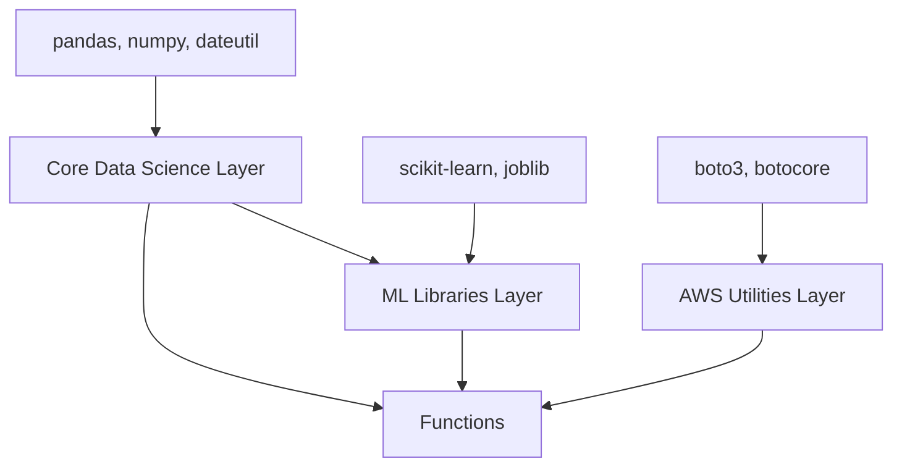

# Lambda Layer Management Guide

## 📋 Overview

This guide provides comprehensive documentation for managing Lambda layers in the optimized deployment system, including creation, updates, maintenance, and best practices.

## 🏗️ Layer Architecture

### Layer Structure
```
layers/
├── core-data-science/
│   ├── requirements.txt          # pandas, numpy, python-dateutil
│   └── python/                   # Built packages (auto-generated)
├── ml-libraries/
│   ├── requirements.txt          # scikit-learn, joblib
│   └── python/                   # Built packages (auto-generated)
└── aws-utilities/
    ├── requirements.txt          # boto3, botocore
    └── python/                   # Built packages (auto-generated)
```

### Layer Dependencies


## 🛠️ Layer Management Commands

### Using the Layer Management Script

The `scripts/manage-layers.sh` script provides a unified interface for all layer operations:

```bash
# Show help
./scripts/manage-layers.sh --help

# Check status of all layers
./scripts/manage-layers.sh status

# Build all layers
./scripts/manage-layers.sh build all

# Build specific layer
./scripts/manage-layers.sh build core-data-science

# Optimize layers
./scripts/manage-layers.sh optimize all

# Validate layers
./scripts/manage-layers.sh validate all

# Generate reports
./scripts/manage-layers.sh report all

# Clean layer artifacts
./scripts/manage-layers.sh clean all
```

### Layer Status Output
```
Lambda Layer Status

Layer                Built      Size (MB)       Status
-----                -----      ---------       ------
core-data-science    Yes        87              ✓ Valid
ml-libraries         Yes        95              ✓ Valid
aws-utilities        Yes        42              ✓ Valid
```

## 🔧 Layer Creation and Building

### Creating a New Layer

1. **Create Layer Directory Structure**
```bash
# Create new layer
mkdir -p layers/new-layer
cd layers/new-layer

# Create requirements file
cat > requirements.txt << 'EOF'
# Add your dependencies here
requests==2.31.0
urllib3==2.0.4
EOF
```

2. **Add Layer to Build Process**
```bash
# Edit build.sh to include new layer
# Add to the build_layers() function:
if ! build_layer "new-layer" "$MAX_LAYER_SIZE_MB"; then
    failed_layers+=("new-layer")
fi
```

3. **Update SAM Template**
```yaml
# Add to template.yaml
NewLayer:
  Type: AWS::Serverless::LayerVersion
  Properties:
    LayerName: new-layer
    ContentUri: layers/new-layer/
    CompatibleRuntimes: [python3.9]
    RetentionPolicy: Delete
```

### Building Layers

#### Automated Build
```bash
# Build all layers with optimization
./build.sh --layers-only

# Build with verbose output
./build.sh --layers-only --verbose

# Build without size validation (not recommended)
./build.sh --layers-only --skip-validation
```

#### Manual Build Process
```bash
# Build specific layer manually
cd layers/core-data-science

# Clean previous build
rm -rf python/

# Install dependencies
pip3 install -r requirements.txt -t python/ --upgrade

# Optimize the layer
python3 ../../scripts/layer-utils.py optimize --layer core-data-science

# Validate the layer
python3 ../../scripts/layer-utils.py validate --layer core-data-science
```

## 📊 Layer Optimization

### Optimization Strategies

#### 1. Automated Optimization
```bash
# Run comprehensive optimization
python3 scripts/layer-utils.py optimize --layer core-data-science --verbose

# Optimization includes:
# - Removing test files and directories
# - Removing documentation and examples
# - Removing compiled bytecode
# - Package-specific optimizations
```

#### 2. Manual Optimization Techniques

**Core Data Science Layer (pandas, numpy)**
```bash
cd layers/core-data-science/python

# Remove pandas test data
rm -rf pandas/tests/
rm -rf pandas/io/tests/
rm -rf pandas/plotting/tests/

# Remove numpy tests and documentation
rm -rf numpy/tests/
rm -rf numpy/doc/
rm -rf numpy/f2py/tests/

# Remove unnecessary files
find . -name "*.pyc" -delete
find . -name "__pycache__" -type d -exec rm -rf {} + 2>/dev/null || true
find . -name "*.dist-info" -type d -exec rm -rf {} + 2>/dev/null || true
```

**ML Libraries Layer (scikit-learn)**
```bash
cd layers/ml-libraries/python

# Remove sklearn datasets (saves ~30MB)
rm -rf sklearn/datasets/

# Remove experimental modules
rm -rf sklearn/experimental/

# Remove less commonly used modules
rm -rf sklearn/gaussian_process/
rm -rf sklearn/semi_supervised/

# Keep only essential scipy modules
cd scipy/
ls | grep -v -E "(linalg|sparse|special|stats|_lib)" | xargs rm -rf
```

**AWS Utilities Layer (boto3)**
```bash
cd layers/aws-utilities/python

# Remove unused AWS service data
cd botocore/data/
ls | grep -v -E "(s3|lambda|dynamodb|sts|iam|cloudformation|logs|events)" | xargs rm -rf
```

#### 3. Advanced Optimization

**Selective Module Installation**
```bash
# Install only specific modules from a package
pip3 install --no-deps scikit-learn -t python/

# Then manually copy only needed modules
mkdir -p python/sklearn
cp -r /usr/local/lib/python3.9/site-packages/sklearn/{ensemble,linear_model,preprocessing,metrics} python/sklearn/
```

**Binary Optimization**
```bash
# Strip debug symbols from shared libraries
find layers/*/python -name "*.so" -exec strip {} \; 2>/dev/null || true

# Remove large binary files if not needed
find layers/*/python -name "*.so" -size +5M -ls
```

## 🔍 Layer Validation and Testing

### Size Validation
```bash
# Check layer sizes
python3 scripts/size-validation.py validate --target layers

# Detailed size report
python3 scripts/size-validation.py report --format text

# Check specific layer
python3 scripts/layer-utils.py validate --layer core-data-science
```

### Import Validation
```bash
# Test layer imports
python3 scripts/layer-utils.py validate --layer core-data-science --verbose

# Manual import test
python3 -c "
import sys
sys.path.insert(0, 'layers/core-data-science/python')
import pandas, numpy
print('✅ Imports successful')
print(f'Pandas: {pandas.__version__}')
print(f'NumPy: {numpy.__version__}')
"
```

### Compatibility Testing
```bash
# Test layer compatibility with functions
export PYTHONPATH="layers/core-data-science/python:layers/ml-libraries/python:$PYTHONPATH"

# Test function imports
python3 -c "
import sys
sys.path.extend([
    'layers/core-data-science/python',
    'layers/ml-libraries/python',
    'layers/aws-utilities/python'
])

# Test all critical imports
import pandas as pd
import numpy as np
import sklearn
import boto3

print('✅ All layer imports successful')
"
```

## 🔄 Layer Updates and Versioning

### Updating Layer Dependencies

1. **Update Requirements File**
```bash
# Update specific package version
cd layers/core-data-science
echo "pandas==2.1.0" >> requirements.txt

# Or regenerate requirements
pip-compile requirements.in --upgrade
```

2. **Rebuild and Test**
```bash
# Clean and rebuild
./scripts/manage-layers.sh clean core-data-science
./scripts/manage-layers.sh build core-data-science

# Validate changes
./scripts/manage-layers.sh validate core-data-science
```

3. **Deploy Updated Layer**
```bash
# Deploy only layers
sam deploy --parameter-overrides UpdateLayersOnly=true

# Or full deployment
./deploy.sh
```

### Version Management

#### Layer Versioning Strategy
```bash
# Tag layer versions
git tag -a layer-v1.0.0 -m "Core data science layer v1.0.0"

# Create version-specific builds
./build.sh --layers-only
cp -r layers/ layers-v1.0.0/
```

#### Rollback Procedures
```bash
# Rollback to previous layer version
aws lambda update-function-configuration \
  --function-name YourFunction \
  --layers arn:aws:lambda:region:account:layer:core-data-science-layer:1

# Or restore from backup
cp -r layers-backup/ layers/
./deploy.sh
```

## 📈 Layer Monitoring and Maintenance

### Performance Monitoring

#### Cold Start Metrics
```python
# Add to Lambda function for monitoring
import time
import json

def lambda_handler(event, context):
    start_time = time.time()
    
    # Import from layers
    import pandas as pd
    import numpy as np
    
    import_time = time.time() - start_time
    
    # Log import time
    print(json.dumps({
        'metric': 'layer_import_time',
        'value': import_time,
        'unit': 'seconds'
    }))
    
    # Your function logic here
    return {'statusCode': 200}
```

#### Size Monitoring
```bash
# Create monitoring script
cat > monitor_layers.py << 'EOF'
#!/usr/bin/env python3
import boto3
import json
from pathlib import Path

def monitor_layer_sizes():
    layers_dir = Path("layers")
    
    for layer_dir in layers_dir.iterdir():
        if layer_dir.is_dir():
            python_dir = layer_dir / "python"
            if python_dir.exists():
                # Calculate size
                total_size = sum(f.stat().st_size for f in python_dir.rglob('*') if f.is_file())
                size_mb = total_size / (1024 * 1024)
                
                print(f"{layer_dir.name}: {size_mb:.2f}MB")
                
                # Alert if size is concerning
                if size_mb > 90:  # 90MB threshold
                    print(f"⚠️  WARNING: {layer_dir.name} is approaching size limit!")

if __name__ == "__main__":
    monitor_layer_sizes()
EOF

python3 monitor_layers.py
```

### Maintenance Tasks

#### Weekly Maintenance
```bash
#!/bin/bash
# weekly_layer_maintenance.sh

echo "=== Weekly Layer Maintenance ==="

# Check layer status
./scripts/manage-layers.sh status

# Validate all layers
./scripts/manage-layers.sh validate all

# Generate size report
python3 scripts/size-validation.py report --format text > reports/weekly-layer-report.txt

# Check for dependency updates
for layer in core-data-science ml-libraries aws-utilities; do
    echo "Checking updates for $layer..."
    cd layers/$layer
    pip list --outdated
    cd ../..
done
```

#### Monthly Maintenance
```bash
#!/bin/bash
# monthly_layer_optimization.sh

echo "=== Monthly Layer Optimization ==="

# Backup current layers
cp -r layers/ layers-backup-$(date +%Y%m%d)/

# Re-optimize all layers
./scripts/manage-layers.sh optimize all

# Validate optimizations
./scripts/manage-layers.sh validate all

# Generate comparison report
python3 scripts/size-validation.py report --format json > reports/monthly-optimization-report.json
```

## 🚨 Troubleshooting Layer Issues

### Common Layer Problems

#### 1. Layer Size Exceeded
```bash
# Symptom: Layer exceeds 100MB limit
# Solution: Aggressive optimization
cd layers/problematic-layer/python

# Remove all test directories
find . -name "tests" -type d -exec rm -rf {} + 2>/dev/null || true
find . -name "test" -type d -exec rm -rf {} + 2>/dev/null || true

# Remove documentation
find . -name "docs" -type d -exec rm -rf {} + 2>/dev/null || true
find . -name "examples" -type d -exec rm -rf {} + 2>/dev/null || true

# Remove large binary files
find . -name "*.so" -size +5M -delete

# Re-validate
cd ../../..
python3 scripts/layer-utils.py validate --layer problematic-layer
```

#### 2. Import Errors
```bash
# Symptom: ImportError when using layer
# Solution: Check dependencies
python3 -c "
import sys
sys.path.insert(0, 'layers/core-data-science/python')
try:
    import pandas
    print('✅ Pandas import successful')
except ImportError as e:
    print(f'❌ Pandas import failed: {e}')
    # Check if numpy is available
    try:
        import numpy
        print('✅ NumPy is available')
    except ImportError:
        print('❌ NumPy is missing - this is the root cause')
"
```

#### 3. Layer Compatibility Issues
```bash
# Symptom: Functions fail after layer update
# Solution: Test compatibility
export PYTHONPATH="layers/core-data-science/python:layers/ml-libraries/python"

# Test function code
python3 functions/enhanced_feature_engineering/app.py

# If it fails, check version compatibility
python3 -c "
import sys
sys.path.insert(0, 'layers/core-data-science/python')
import pandas, numpy
print(f'Pandas: {pandas.__version__}')
print(f'NumPy: {numpy.__version__}')

# Check if versions are compatible
import sklearn
print(f'Scikit-learn: {sklearn.__version__}')
"
```

## 📚 Best Practices

### Layer Design Principles

1. **Single Responsibility**: Each layer should have a clear purpose
2. **Minimal Dependencies**: Include only necessary packages
3. **Size Optimization**: Always optimize for size
4. **Version Pinning**: Pin dependency versions for consistency
5. **Testing**: Always test layers before deployment

### Development Workflow

```bash
# 1. Create/modify layer
vim layers/core-data-science/requirements.txt

# 2. Build and test locally
./scripts/manage-layers.sh build core-data-science
./scripts/manage-layers.sh validate core-data-science

# 3. Test with functions
export PYTHONPATH="layers/core-data-science/python:$PYTHONPATH"
python3 functions/data_validation/app.py

# 4. Deploy to development environment
./deploy.sh --environment dev

# 5. Test deployed functions
curl "https://api-endpoint/predict?test=true"

# 6. Deploy to production
./deploy.sh --environment prod
```

### Security Considerations

```bash
# Scan layer dependencies for vulnerabilities
pip-audit -r layers/core-data-science/requirements.txt

# Check for known security issues
safety check -r layers/core-data-science/requirements.txt

# Remove unnecessary files that might contain sensitive data
find layers/*/python -name "*.key" -delete
find layers/*/python -name "*.pem" -delete
find layers/*/python -name "*.crt" -delete
```

## 📊 Layer Analytics and Reporting

### Generate Comprehensive Layer Report

```bash
# Create detailed layer analysis
cat > analyze_layers.py << 'EOF'
#!/usr/bin/env python3
import json
from pathlib import Path
from datetime import datetime

def analyze_layers():
    layers_dir = Path("layers")
    report = {
        "timestamp": datetime.now().isoformat(),
        "layers": {}
    }
    
    for layer_dir in layers_dir.iterdir():
        if layer_dir.is_dir():
            python_dir = layer_dir / "python"
            if python_dir.exists():
                # Analyze layer
                packages = []
                total_size = 0
                
                for item in python_dir.iterdir():
                    if item.is_dir() and not item.name.startswith('.'):
                        item_size = sum(f.stat().st_size for f in item.rglob('*') if f.is_file())
                        packages.append({
                            "name": item.name,
                            "size_mb": round(item_size / (1024 * 1024), 2)
                        })
                        total_size += item_size
                
                packages.sort(key=lambda x: x['size_mb'], reverse=True)
                
                report["layers"][layer_dir.name] = {
                    "total_size_mb": round(total_size / (1024 * 1024), 2),
                    "package_count": len(packages),
                    "packages": packages[:10]  # Top 10 packages
                }
    
    return report

if __name__ == "__main__":
    report = analyze_layers()
    print(json.dumps(report, indent=2))
EOF

python3 analyze_layers.py > reports/layer-analysis.json
```

### Usage Tracking

```python
# Add to Lambda functions to track layer usage
import json
import boto3

def track_layer_usage(layer_name, function_name):
    """Track which layers are used by which functions"""
    cloudwatch = boto3.client('cloudwatch')
    
    cloudwatch.put_metric_data(
        Namespace='Lambda/Layers',
        MetricData=[
            {
                'MetricName': 'LayerUsage',
                'Dimensions': [
                    {'Name': 'LayerName', 'Value': layer_name},
                    {'Name': 'FunctionName', 'Value': function_name}
                ],
                'Value': 1,
                'Unit': 'Count'
            }
        ]
    )
```

---

**🎯 Summary**: This guide provides comprehensive layer management capabilities for the optimized Lambda deployment. Regular maintenance and monitoring ensure layers remain efficient and functional.

For additional support, refer to the troubleshooting guide or contact your AWS solutions architect.