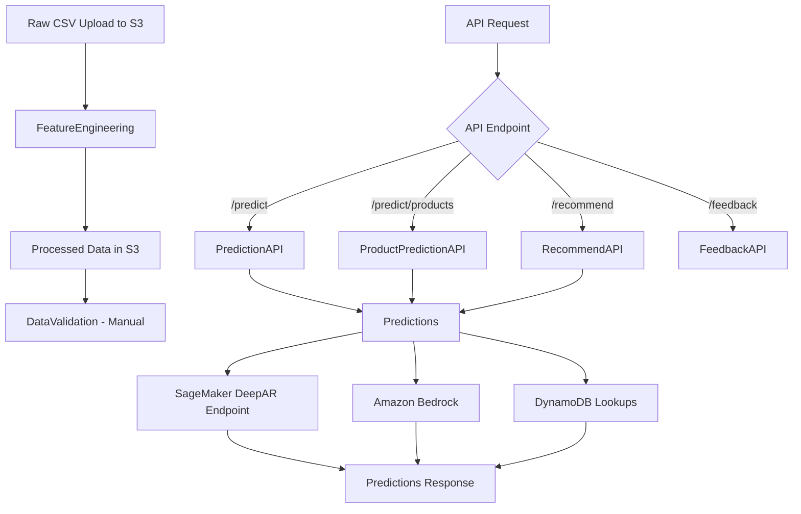

# Enhanced Order Prediction Solution

A comprehensive AWS-based solution for predicting customer orders using Amazon Forecast and Amazon Bedrock, with enhanced product-level forecasting capabilities.

## 🚀 Features

### Check list

-- Define Ai Objectives
-- Measurable
-- Preliminary Schedule
-- Research The Ai Market
-- Identify Data Sources
-- Ai Feasibility Analysis
-- Ai Legal And Ethical Considerations
-- Attain Stakeholder Buy-In
-- Define Onboarding Process
-- Access To Domain


### Core Capabilities
- **Automated Data Processing**: Intelligent feature engineering with temporal and product-level features
- **Product-Level Forecasting**: Individual product demand prediction for better inventory management
- **AI-Enhanced Insights**: Amazon Bedrock integration for intelligent recommendations
- **Real-time APIs**: RESTful endpoints for predictions and recommendations
- **Feedback Loop**: Continuous learning through user feedback collection
- **Data Validation**: Automated data quality checks and validation
- **Monitoring**: CloudWatch alarms and comprehensive logging

### New Enhancements
- **Enhanced Feature Engineering**: Advanced temporal features, cyclical encoding, and product categorization
- **Product Lookup System**: DynamoDB-based product catalog with customer-facility relationships
- **Prediction Caching**: Performance optimization through intelligent caching
- **Multi-level Forecasting**: Both aggregate and product-level predictions
- **Recommendation Engine**: AI-powered product recommendations for reordering and new products

## 🏗️ Architecture & Function Flow

### Lambda Function Workflow



### Function Responsibilities

#### 🔄 **Data Processing Functions**
1. **FeatureEngineering** (Triggered by S3)
   - Processes raw CSV files uploaded to S3
   - Creates temporal features (day of week, seasonality, trends)
   - Generates product demand patterns and statistics
   - Creates lookup tables for products and customer-product relationships
   - Formats data for SageMaker DeepAR training
   - Saves processed data, lookups, and forecast-ready data to S3
   - Updates DynamoDB with product catalog information

2. **DataValidation** (Manual invoke only)
   - Validates processed data quality and completeness
   - Generates comprehensive data profiling reports
   - Performs business rule validation
   - Creates data distribution analysis
   - Currently not auto-triggered (requires manual invocation)

#### 🤖 **ML & Prediction Functions**
3. **Predictions** (Called by API functions)
   - Core prediction engine using pre-trained SageMaker DeepAR model
   - Integrates with Amazon Bedrock for AI-powered insights
   - Queries DynamoDB for product and customer data
   - Generates both aggregate and product-level forecasts
   - Implements caching for performance optimization
   - Returns structured prediction data to API functions

#### 🌐 **API Functions** (Triggered by API Gateway)
4. **PredictionAPI** (`GET /predict`)
   - Handles basic prediction requests
   - Validates customer and facility parameters
   - Calls Predictions for ML predictions
   - Returns aggregate order predictions with confidence intervals

5. **ProductPredictionAPI** (`GET /predict/products`)
   - Handles product-level prediction requests
   - Supports filtering by specific products or categories
   - Returns detailed product-by-product forecasts
   - Includes product metadata and demand patterns

6. **RecommendAPI** (`GET /recommend`)
   - Provides AI-powered product recommendations
   - Supports different recommendation types (reorder, new products, seasonal)
   - Uses Bedrock for intelligent recommendation reasoning
   - Returns prioritized product suggestions with explanations

7. **FeedbackAPI** (`POST /feedback`)
   - Collects user feedback on prediction accuracy
   - Stores feedback in DynamoDB for model improvement
   - Supports various feedback types (accuracy, usefulness, etc.)
   - Enables continuous learning and model refinement

## 🏗️ Architecture

```
┌─────────────────┐    ┌──────────────────┐    ┌─────────────────┐
│   Raw Data      │    │   Enhanced       │    │   Sagemaker     │
│   (S3 Bucket)   │───▶│   Feature Eng.   │───▶│   Canvas        │
└─────────────────┘    └──────────────────┘    └─────────────────┘
                                │                        │
                                ▼                        ▼
┌─────────────────┐    ┌──────────────────┐    ┌─────────────────┐
│   Product       │    │   Data           │    │   Enhanced      │
│   Lookup (DDB)  │◀───│   Validation     │    │   Predictions   │
└─────────────────┘    └──────────────────┘    └─────────────────┘
                                                        │
                                                        ▼
┌─────────────────┐    ┌──────────────────┐    ┌─────────────────┐
│   API Gateway   │◀───│   Prediction     │◀───│   Amazon        │
│   (REST APIs)   │    │   Cache (DDB)    │    │   Bedrock       │
└─────────────────┘    └──────────────────┘    └─────────────────┘
```

## 🔧 Lambda Functions in This Stack

### Current Deployed Functions (Stack: item-prediction)

| # | Logical Name | Physical Function Name | Purpose | Trigger |
|---|--------------|------------------------|---------|---------|
| 1 | **FeatureEngineering** | `item-prediction-EnhancedFeatureEngineeri-ESNfjtI1CW1W` | Main data processing, feature engineering, creates lookups | S3 raw data upload |
| 2 | **DataValidation** | `item-prediction-DataValidation-ydgv0ZZYdYsi` | Data quality validation and checks | Manual invoke only |
| 3 | **Predictions** | `item-prediction-EnhancedPredictionsFunct-o8M2QC3E25P2` | ML predictions using SageMaker and Bedrock | Called by API functions |
| 4 | **PredictionAPI** | `item-prediction-PredictionAPI-a10hQXzs0KCe` | REST API for basic predictions | API Gateway `/predict` |
| 5 | **ProductPredictionAPI** | `item-prediction-ProductPredictionAPIFunc-O1nr9guw7tQp` | REST API for product-level predictions | API Gateway `/predict/products` |
| 6 | **RecommendAPI** | `item-prediction-RecommendAPI-gPsT373hi2KQ` | REST API for AI recommendations | API Gateway `/recommend` |
| 7 | **FeedbackAPI** | `item-prediction-FeedbackAPI-fQMYWHwfPHhs` | REST API for feedback collection | API Gateway `/feedback` |

### ⚠️ Naming Inconsistency Notice
**Important**: There are naming inconsistencies in the codebase:
- **CloudFormation Stack**: `item-prediction` (actual deployed name)
- **Some scripts reference**: `item-prediction` (outdated references)
- **Bucket names contain**: `item-prediction` (from previous deployments)

## 📋 Prerequisites

- AWS CLI installed and configured
- SAM CLI installed
- Python 3.9 or higher
- jq (for parsing JSON outputs)
- Valid AWS credentials with appropriate permissions

### Required AWS Permissions
- Amazon S3 (full access)
- Amazon DynamoDB (full access)
- Amazon SageMaker (invoke endpoint permissions)
- Amazon Bedrock (invoke model permissions)
- AWS Lambda (full access)
- Amazon API Gateway (full access)
- AWS CloudFormation (full access)
- AWS IAM (role creation permissions)

## 🚀 Quick Start

### 1. Clone and Deploy

```bash
# Deploy with default settings (creates item-prediction stack)
./deploy.sh

# Or deploy with custom settings
./deploy.sh --stack-name item-prediction \
           --region us-east-1 \
           --environment prod \
           --bedrock-model anthropic.claude-3-sonnet-20240229-v1:0

# Note: Current deployment uses stack name "item-prediction"
# Some legacy scripts may reference "item-prediction" - update as needed
```

### 2. Upload Sample Data

```bash
# Upload your historical order data
aws s3 cp your-order-data.csv s3://order-prediction-raw-data-{ACCOUNT-ID}-{ENV}/
```

### 3. Test the APIs

```bash
# Current API Gateway Endpoint (from deployment)
API_ENDPOINT="https://g08inrsas0.execute-api.us-east-1.amazonaws.com/Prod"

# Get aggregate predictions
curl "$API_ENDPOINT/predict?customerId=CUST001&facilityId=FAC001"

# Get product-level predictions  
curl "$API_ENDPOINT/predict/products?customerId=CUST001&facilityId=FAC001"

# Get recommendations
curl "$API_ENDPOINT/recommend?customerId=CUST001&facilityId=FAC001&type=reorder"

# Submit feedback
curl -X POST "$API_ENDPOINT/feedback" \
  -H "Content-Type: application/json" \
  -d '{"customer_id":"CUST001","facility_id":"FAC001","rating":4}'
```

### Current Deployed Resources

| Resource Type | Name | Purpose |
|---------------|------|---------|
| **API Gateway** | `https://g08inrsas0.execute-api.us-east-1.amazonaws.com/Prod/` | Main API endpoint |
| **S3 Raw Data** | `item-prediction-rawdatabucket-sankmq5hrvsu` | Upload CSV files here |
| **S3 Processed** | `item-prediction-processeddatabucket-3sdqfh2qnotf` | Processed data output |
| **DynamoDB Product Lookup** | `OrderPredictionProductLookup-dev` | Product catalog |
| **DynamoDB Cache** | `OrderPredictionCache-dev` | Prediction caching |

## 📊 Data Format

### Input Data Schema

Your CSV files should contain the following columns:

```csv
CreateDate,CustomerID,FacilityID,ProductID,Quantity,UnitPrice,ProductCategory,ProductDescription
2025-01-01,CUST001,FAC001,PROD001,100,25.50,Electronics,Widget A
2025-01-02,CUST001,FAC001,PROD002,50,15.75,Office Supplies,Paper Clips
```

### Required Columns
- `CreateDate`: Order date (YYYY-MM-DD format)
- `CustomerID`: Unique customer identifier
- `FacilityID`: Customer facility identifier
- `ProductID`: Product identifier
- `Quantity`: Order quantity (numeric)

### Optional Columns (for enhanced features)
- `UnitPrice`: Product unit price
- `ProductCategory`: Product category
- `ProductDescription`: Product description
- `SeasonalFlag`: Seasonal indicator (Y/N)

## 🔧 Configuration

### Environment Variables

The solution supports the following configuration options:

| Parameter | Default | Description |
|-----------|---------|-------------|
| `Environment` | `dev` | Deployment environment (dev/test/prod) |
| `BedrockModelId` | `anthropic.claude-3-sonnet-20240229-v1:0` | Bedrock model for AI insights |
| `EnableProductLevelForecasting` | `true` | Enable product-level predictions |

### Customization

You can customize the solution by modifying:

1. **Feature Engineering**: Edit `functions/enhanced_feature_engineering/app.py`
2. **Prediction Logic**: Edit `functions/enhanced_predictions/app.py`
3. **API Responses**: Edit the respective API function files
4. **CloudFormation Template**: Edit `template.yaml`

## 📈 API Reference

### Prediction Endpoints

#### GET /predict
Get aggregate order predictions for a customer facility.

**Parameters:**
- `customerId` (required): Customer identifier
- `facilityId` (required): Facility identifier

**Response:**
```json
{
  "predictions": [
    {
      "date": "2025-07-01",
      "predicted_quantity": 150.5,
      "confidence_interval": {
        "lower": 120.0,
        "upper": 180.0
      }
    }
  ],
  "insights": "Based on historical patterns, expect 15% increase in July orders."
}
```

#### GET /predict/products
Get product-level predictions.

**Parameters:**
- `customerId` (required): Customer identifier
- `facilityId` (required): Facility identifier
- `productId` (optional): Specific product ID

**Response:**
```json
{
  "product_predictions": [
    {
      "product_id": "PROD001",
      "product_name": "Widget A",
      "predictions": [
        {
          "date": "2025-07-01",
          "predicted_quantity": 75.0,
          "confidence": 0.85
        }
      ]
    }
  ]
}
```

#### GET /recommend
Get AI-powered product recommendations.

**Parameters:**
- `customerId` (required): Customer identifier
- `facilityId` (required): Facility identifier
- `type` (optional): Recommendation type (`reorder`, `new_products`, `seasonal`)

**Response:**
```json
{
  "recommendations": [
    {
      "product_id": "PROD001",
      "product_name": "Widget A",
      "recommendation_type": "reorder",
      "suggested_quantity": 100,
      "reason": "Due for reorder based on consumption pattern",
      "confidence": 0.9
    }
  ]
}
```

#### POST /feedback
Submit feedback on predictions.

**Request Body:**
```json
{
  "customer_id": "CUST001",
  "facility_id": "FAC001",
  "prediction_id": "pred-123",
  "feedback_type": "accuracy",
  "rating": 4,
  "comments": "Prediction was close to actual demand",
  "actual_quantity": 145.0,
  "predicted_quantity": 150.5
}
```

## 🎯 Model Training & Deployment

### Important: No Model Training in Lambda Functions

**The Lambda functions do NOT train machine learning models.** Here's how the ML pipeline actually works:

#### Current ML Architecture:
```
Jupyter Notebook → SageMaker Training Job → Deployed Model Endpoint
     (Training)         (Model Creation)        (Inference Only)
                                                      ↑
                                            Lambda Functions Call This
```

#### What Each Component Does:
- **Jupyter Notebook** (`hybrent.ipynb`): Contains the actual model training code
- **SageMaker Training Job**: Creates and trains the DeepAR model
- **Model Endpoint**: `hybrent-deepar-2025-07-20-23-56-22-287` (pre-trained, deployed)
- **Lambda Functions**: Call the pre-trained endpoint for predictions

#### Lambda Functions Role:
- ✅ **Data Processing**: Prepare data for training format
- ✅ **Feature Engineering**: Create features matching notebook approach  
- ✅ **Inference**: Call pre-trained SageMaker endpoint
- ✅ **API Services**: Serve predictions via REST APIs
- ❌ **Model Training**: Not performed in Lambda (done in notebook)

#### For Production Model Training:
To implement automated model retraining, you would need to add:
1. **Training Lambda Function**: Triggers SageMaker training jobs
2. **Model Deployment Lambda**: Updates endpoints with new models
3. **Scheduled Retraining**: CloudWatch Events for periodic training
4. **Model Versioning**: Track and manage model versions

## ⚠️ Known Issues & Fixes

### Naming Inconsistency Resolution

The codebase has mixed references between `item-prediction` and `item-prediction`. Here's how to fix:

#### Current State:
- **Actual Stack Name**: `item-prediction`
- **Actual Function Names**: `item-prediction-*`
- **Legacy References**: Many scripts still reference `item-prediction`

#### Files That Need Updates:
1. **upload_new_file.sh** - Update bucket names and function references
2. **deploy.sh** - Default stack name should be `item-prediction`
3. **Various test scripts** - Update stack and function name references
4. **Documentation** - Update all command examples

#### Quick Fix Commands:
```bash
# Update bucket names in upload script
sed -i 's/item-prediction/item-prediction/g' upload_new_file.sh

# Update deploy script default
sed -i 's/STACK_NAME="item-prediction"/STACK_NAME="item-prediction"/g' deploy.sh

# Update test scripts
find . -name "*.sh" -exec sed -i 's/item-prediction/item-prediction/g' {} \;
find . -name "*.py" -exec sed -i 's/item-prediction/item-prediction/g' {} \;
```

## 🔍 Monitoring and Troubleshooting

### CloudWatch Logs

Monitor the solution using CloudWatch logs:

```bash
# View all logs (use correct stack name)
sam logs --stack-name item-prediction --region us-east-1

# View specific function logs (use actual function names)
aws logs tail /aws/lambda/item-prediction-EnhancedFeatureEngineeri-ESNfjtI1CW1W --follow
aws logs tail /aws/lambda/item-prediction-DataValidation-ydgv0ZZYdYsi --follow
aws logs tail /aws/lambda/item-prediction-EnhancedPredictionsFunct-o8M2QC3E25P2 --follow
```

### CloudWatch Alarms

The solution includes pre-configured alarms for:
- Lambda function errors
- API Gateway 4xx/5xx errors
- DynamoDB throttling

### Comprehensive Documentation

For detailed guidance on optimization and troubleshooting:

- **[Lambda Optimization Guide](LAMBDA_OPTIMIZATION_GUIDE.md)** - Complete optimization process documentation
- **[Troubleshooting Guide](TROUBLESHOOTING_OPTIMIZATION.md)** - Common issues and solutions
- **[Layer Management Guide](LAYER_MANAGEMENT_GUIDE.md)** - Layer creation, updates, and maintenance

### Common Issues

1. **Data Processing Failures**
   - Check data format matches expected schema
   - Verify S3 bucket permissions
   - Review CloudWatch logs for specific errors

2. **Forecast Creation Issues**
   - Ensure sufficient historical data (minimum 100 data points)
   - Check Forecast service limits
   - Verify IAM permissions for Forecast service

3. **API Errors**
   - Verify API Gateway deployment
   - Check Lambda function permissions
   - Review request parameters

4. **Lambda Size Issues**
   - See [Lambda Optimization Guide](LAMBDA_OPTIMIZATION_GUIDE.md) for size optimization
   - Use [Troubleshooting Guide](TROUBLESHOOTING_OPTIMIZATION.md) for specific size-related errors

## 💰 Cost Optimization

### Estimated Monthly Costs (us-east-1)

| Service | Usage | Estimated Cost |
|---------|-------|----------------|
| Lambda | 1M requests, 512MB | $20 |
| API Gateway | 1M requests | $3.50 |
| DynamoDB | 1GB storage, 100 RCU/WCU | $25 |
| S3 | 10GB storage, 1000 requests | $2 |
| Forecast | 1 predictor, 1000 forecasts | $50 |
| Bedrock | 1M tokens | $15 |
| **Total** | | **~$115** |

### Cost Optimization Tips

1. **Use S3 Lifecycle Policies**: Automatically delete old data
2. **DynamoDB On-Demand**: Use on-demand billing for variable workloads
3. **Lambda Memory Optimization**: Right-size Lambda memory allocation
4. **Forecast Cleanup**: Delete unused predictors and forecasts
5. **API Caching**: Enable API Gateway caching for frequently accessed endpoints

## 🔒 Security Best Practices

### Implemented Security Features

- **IAM Least Privilege**: Functions have minimal required permissions
- **VPC Support**: Can be deployed in VPC for network isolation
- **Encryption**: All data encrypted at rest and in transit
- **API Authentication**: Support for API keys and IAM authentication
- **Input Validation**: Comprehensive input validation in all functions

### Additional Security Recommendations

1. **Enable AWS CloudTrail**: Monitor API calls and changes
2. **Use AWS WAF**: Protect API Gateway from common attacks
3. **Implement API Rate Limiting**: Prevent abuse and control costs
4. **Regular Security Reviews**: Audit IAM permissions and access patterns
5. **Data Classification**: Classify and protect sensitive data appropriately

## 🤝 Contributing

To contribute to this solution:

1. Fork the repository
2. Create a feature branch
3. Make your changes
4. Test thoroughly
5. Submit a pull request

### Development Setup

```bash
# Install development dependencies
pip install -r requirements-dev.txt

# Run tests
python -m pytest tests/

# Format code
black functions/
```

## 📞 Support

For support and questions:

1. **Documentation**: Check this README and inline code comments
2. **AWS Support**: Use AWS Support for service-specific issues
3. **CloudWatch Logs**: Check logs for detailed error information
4. **GitHub Issues**: Report bugs and feature requests

## 📄 License

This solution is provided under the MIT License. See LICENSE file for details.

## 🔄 Version History

### v2.0.0 (Current)
- Enhanced product-level forecasting
- AI-powered recommendations
- Improved feature engineering
- Performance optimizations
- Comprehensive monitoring

### v1.0.0
- Basic order prediction functionality
- Simple API endpoints
- Basic data processing

---

**Happy Forecasting! 🎯**
